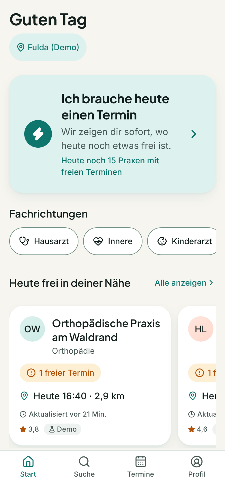
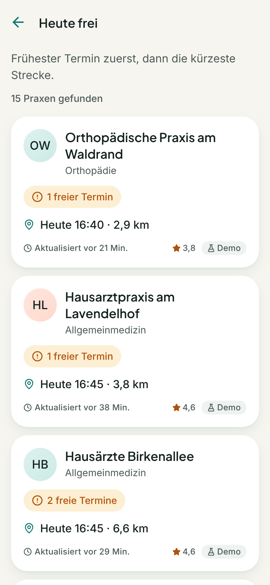
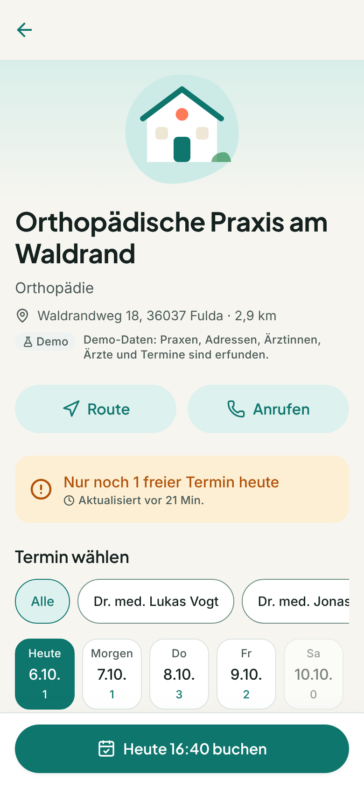
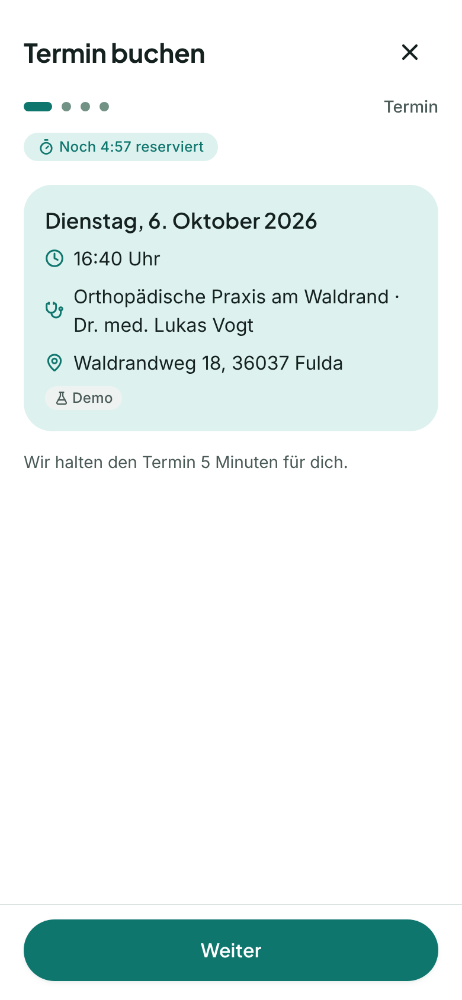
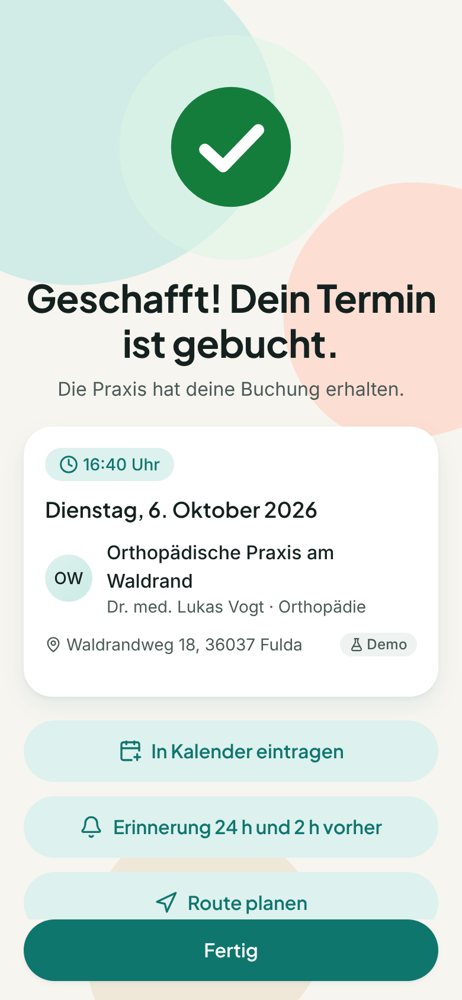
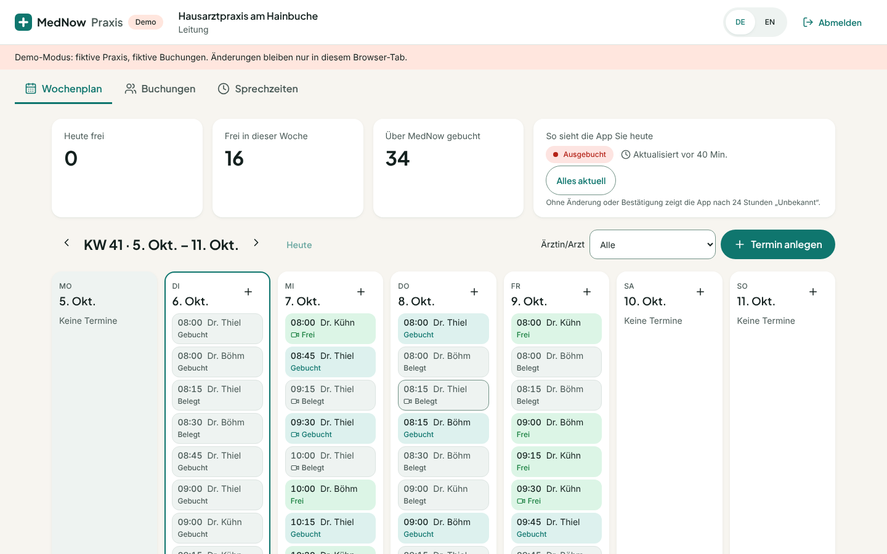
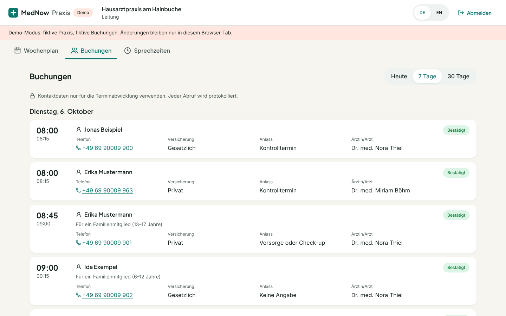
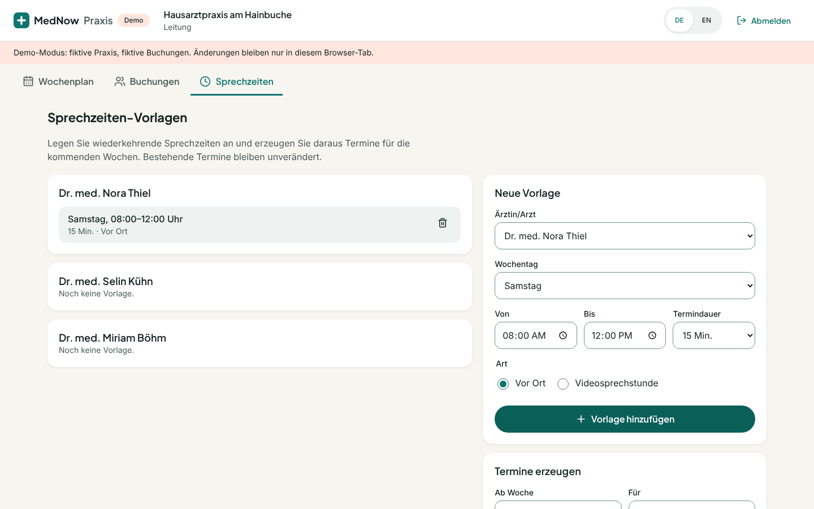

# MedNow (Arbeitstitel)

App für iOS und Android, mit der Menschen in Deutschland freie Arzttermine in ihrer Nähe finden und buchen.

**North Star:** Ein kranker, gestresster Mensch findet in unter 60 Sekunden einen freien Termin in seiner Nähe.

| Start                                  | Home                               | Akut-Modus                          | Praxis                                   | Buchung                                  | Erfolg                                  |
| -------------------------------------- | ---------------------------------- | ----------------------------------- | ---------------------------------------- | ---------------------------------------- | --------------------------------------- |
|  |  |  |  |  |  |

> Screenshots aus der Web-Vorschau (Demo-Daten Fulda). Auf iOS/Android nutzt die App native Tabs und eine MapLibre-Karte.

---

## Inhalt

- **App** (`src/`): Expo SDK 57, React Native 0.86 (New Architecture), TypeScript strict, Expo Router.
- **Backend** (`supabase/`): Postgres + PostGIS, Row Level Security, Realtime (Broadcast), Edge Functions (Deno), pg_cron.
- **Praxis-Dashboard** (`dashboard/`): Web-App (Vite + React) für Praxen – Slots pflegen, Buchungen sehen.
- **Dokumentation** (`docs/`): Architektur, Entscheidungen, Datenquellen, 116117-Studie, Legal-Checkliste, Barrierefreiheits-Audit.

## Schnellstart (Demo ohne Backend)

Voraussetzungen: Node.js 22 (siehe `.nvmrc`).

```bash
npm ci
npx expo start
```

- **Web-Vorschau:** Taste `w` (Karte im Web nicht verfügbar – die Liste ist gleichwertig).
- **Expo Go:** QR-Code scannen. Alles funktioniert außer der Karte (nativer Code).
- **Development Build (empfohlen, mit Karte):**
  ```bash
  npx eas-cli@latest login
  npx eas-cli@latest init            # legt das EAS-Projekt an, EAS_PROJECT_ID setzen
  npx eas-cli@latest build --profile development --platform ios      # bzw. android
  ```
  App per QR-Code installieren, dann `npx expo start --dev-client`.

Ohne Supabase-Zugangsdaten läuft die App automatisch im **Demo-Modus** (`EXPO_PUBLIC_DATA_MODE=memory`): rund 60 erfundene Praxen in Fulda, 12 Fachrichtungen, Termine für 14 Tage. Alle Demo-Daten sind in der App als „Demo“ gekennzeichnet. Die Warteliste wird simuliert: Rund 20 Sekunden nach dem Eintragen wird ein Termin frei.

Konfiguration: `.env.example` nach `.env.local` kopieren (Demo-Stadt, Kartenstil, Supabase, Monitoring).

## Mit Supabase (echtes Backend)

1. Projekt auf [supabase.com](https://supabase.com) anlegen – **Region: Central EU (Frankfurt), eu-central-1**.
2. CLI verbinden und Datenbank aufsetzen:
   ```bash
   npx supabase login
   npx supabase link --project-ref <ref>
   npx supabase config push                 # u. a. anonyme Anmeldung, E-Mail-OTP, Schema "app"
   npm run seed:sql                         # supabase/seed.sql aus dem Demo-Generator erzeugen
   npx supabase db push --include-seed      # Migrationen + Demo-Daten
   ```
3. Secrets (Vault, im SQL-Editor):
   ```sql
   select vault.create_secret('<mind. 32 Zeichen Zufall>', 'mednow_field_key');      -- Feldverschlüsselung
   select vault.create_secret('https://<ref>.supabase.co/functions/v1', 'mednow_functions_url');
   select vault.create_secret('<Zufall>', 'mednow_worker_secret');                   -- Push-Worker
   ```
4. Edge Functions deployen:
   ```bash
   npx supabase secrets set WORKER_SECRET=<gleicher Wert wie mednow_worker_secret> EXPO_ACCESS_TOKEN=<optional>
   npx supabase functions deploy
   ```
5. App konfigurieren (`.env.local` bzw. EAS-Umgebungsvariablen):
   ```
   EXPO_PUBLIC_DATA_MODE=supabase
   EXPO_PUBLIC_SUPABASE_URL=https://<ref>.supabase.co
   EXPO_PUBLIC_SUPABASE_ANON_KEY=<anon/publishable key>
   ```
   **Niemals** den Service-Role-Key in die App oder ins Repo.

## Tests und Qualität

| Befehl                                           | Prüft                                                                                                                        |
| ------------------------------------------------ | ---------------------------------------------------------------------------------------------------------------------------- |
| `npm test`                                       | Unit-, Komponenten- und Ablauftests (Jest, TZ=UTC)                                                                           |
| `npm run lint`                                   | ESLint inkl. „keine Farb-Literale/Texte außerhalb Tokens/i18n“                                                               |
| `npm run typecheck`                              | TypeScript strict                                                                                                            |
| `npm run check:contrast`                         | Alle Farbpaare gegen WCAG 2.1 AA (hell + dunkel)                                                                             |
| `npm run check:i18n`                             | Schlüsselparität de/en, du/Sie-Varianten, unbekannte Schlüssel                                                               |
| `npm run check`                                  | alles oben zusammen                                                                                                          |
| `npm run db:test`                                | Migrationen + Seed + pgTAP (RLS, Buchung, Warteliste) + 50 parallele Buchungen (braucht PostgreSQL 16 mit PostGIS und pgTAP) |
| `cd supabase/functions && deno test --allow-env` | Edge Functions                                                                                                               |
| `cd dashboard && npm run check`                  | Praxis-Dashboard: Lint, Typecheck, Vitest inkl. axe-Barrierefreiheitsprüfung                                                 |
| `maestro test .maestro/`                         | E2E: Akut buchen, Suche & buchen, Warteliste (Development Build)                                                             |

CI (GitHub Actions) führt alles außer Maestro bei jedem Push aus (`.github/workflows/ci.yml`).

## Veröffentlichen mit Expo (EAS)

Erst veröffentlichen, wenn alles abgenommen ist. Ablauf:

```bash
npx eas-cli@latest build --profile preview --platform all      # interne Testversion (TestFlight/APK)
npx eas-cli@latest build --profile production --platform all   # Store-Builds
npx eas-cli@latest submit --platform ios                       # App Store Connect
npx eas-cli@latest submit --platform android                   # Google Play
npx eas-cli@latest update --channel production                 # OTA-Updates (nur JS/Assets)
```

Vorher: `docs/legal-checklist.md` abarbeiten (Impressum, Datenschutz, AVV, Store-Datenschutzangaben, Markenrecht „MedNow“).

## Praxis-Dashboard

```bash
npm ci                       # Hauptverzeichnis (gemeinsamer Domain-Code und Tokens)
cd dashboard
npm ci
npm run dev                  # http://localhost:5173 – ohne Zugangsdaten im Demo-Modus
```

Mit Supabase: `.env.example` nach `.env.local` kopieren (`VITE_SUPABASE_URL`, `VITE_SUPABASE_ANON_KEY`).
Praxis-Zugänge, Zwei-Faktor-Pflicht und Sicherheitsmaßnahmen: siehe [`dashboard/README.md`](dashboard/README.md).

| Wochenplan                                         | Buchungen                                             | Sprechzeiten                                              |
| -------------------------------------------------- | ----------------------------------------------------- | --------------------------------------------------------- |
|  |  |  |

## Projektstruktur

```
src/app/          Routen (Expo Router)          src/features/   Screens je Feature
src/components/   Design-System                  src/domain/     Reine Logik (Status, Ranking, Zeit, Geo, Seed)
src/design/       Tokens + Theme                 src/data/       Repository (Memory/Supabase), Query-Hooks
src/i18n/         de/en, du/Sie                  supabase/       Migrationen, Edge Functions, Tests
scripts/          Kontrast, i18n, Seed, DB-Tests dashboard/       Praxis-Dashboard (Web)
```

Offene Punkte: [`TODO.md`](TODO.md).
