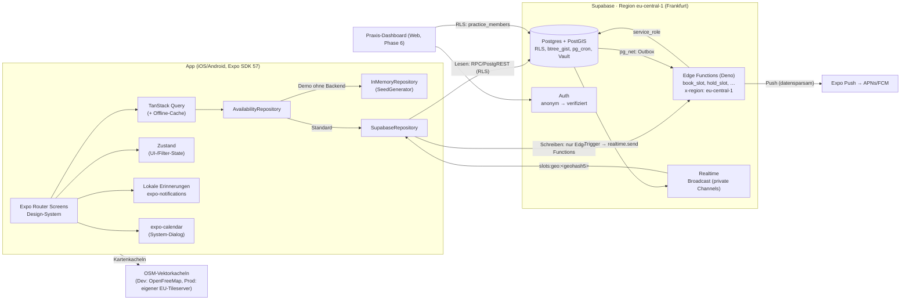
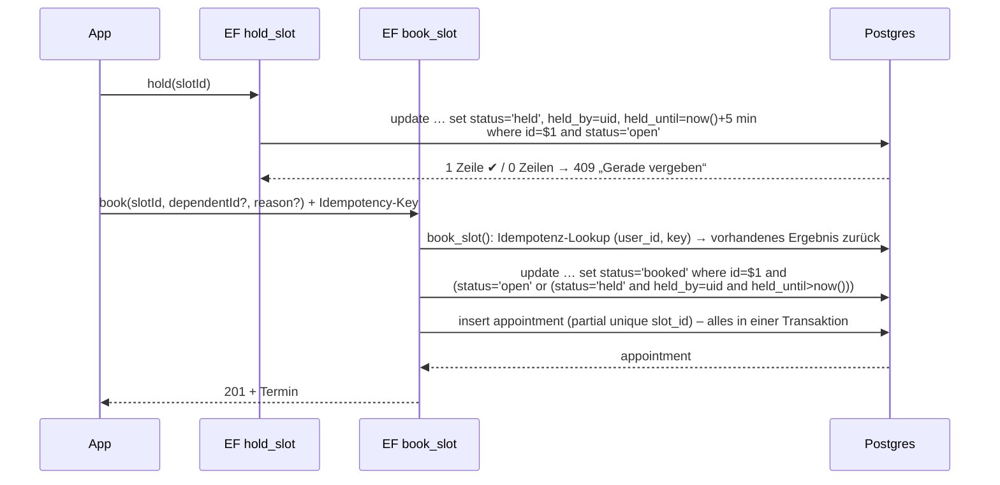
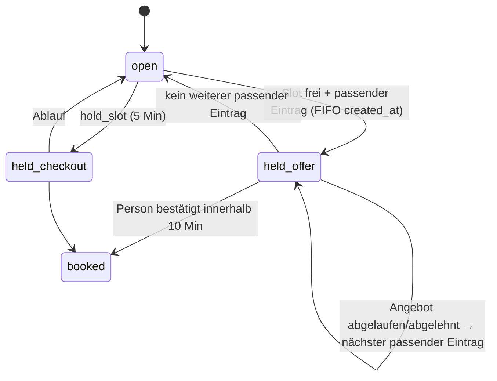

# MedNow – Architektur (Phase 0)

> Stand: 06.10.2026 · Status: **umgesetzt** (Phasen 1–6). Abweichungen während der Umsetzung: `docs/decisions.md` ab D-28
> (u. a. Routen unter `src/app/`, Schriften zur Laufzeit, Schema `app` für service_role).
> Arbeitstitel „MedNow“, zentral änderbar in `src/config/brand.ts` (Markenrecht vor Launch prüfen).

**North Star:** Ein kranker, gestresster Mensch findet in unter 60 Sekunden einen freien Termin in seiner Nähe.
Jede Architekturentscheidung unten ist daran gemessen: weniger Taps, weniger Wartezeit, ehrliche Daten.

---

## 1. Recherchierte Versionen (Stand 06.10.2026)

Quelle: npm-Registry (`dist-tags`, `peerDependencies`) und `bundledNativeModules.json` aus `expo@57.0.26`.
Native Pakete werden **immer über `npx expo install`** installiert, damit die SDK-kompatible Version gewählt wird –
die npm-„latest“ ist bei mehreren Paketen neuer als das, was SDK 57 unterstützt (Spalte „npm latest“).

| Bereich     | Paket                                                                                                                                                                                                                                                                                  | Version (gepinnt)       | npm latest | Anmerkung                                                                   |
| ----------- | -------------------------------------------------------------------------------------------------------------------------------------------------------------------------------------------------------------------------------------------------------------------------------------- | ----------------------- | ---------- | --------------------------------------------------------------------------- |
| Plattform   | `expo`                                                                                                                                                                                                                                                                                 | **SDK 57** (`~57.0.26`) | 57.0.26    | stabil seit 30.06.2026; SDK 58 nur im Beta-Kanal (`next`) → nicht verwenden |
|             | `react-native`                                                                                                                                                                                                                                                                         | 0.86.3                  | 0.87.1     | New Architecture ist seit SDK 55 die einzige Architektur                    |
|             | `react`                                                                                                                                                                                                                                                                                | 19.2.3                  | 19.3.0     | SDK-Pin                                                                     |
|             | `typescript`                                                                                                                                                                                                                                                                           | ~6.0.3                  | 7.0.2      | Expo-Template SDK 57 pinnt TS 6.0; `strict: true`                           |
| Navigation  | `expo-router`                                                                                                                                                                                                                                                                          | ~57.0.24                | –          | Native Stack; Tabs über `expo-router/unstable-native-tabs` (s. D-07)        |
|             | `react-native-screens`                                                                                                                                                                                                                                                                 | ~4.26.0                 | –          |                                                                             |
| Animation   | `react-native-reanimated`                                                                                                                                                                                                                                                              | 4.5.1                   | 4.7.1      | 4.7 verlangt Worklets 0.13 → SDK-Pin nutzen                                 |
|             | `react-native-worklets`                                                                                                                                                                                                                                                                | 0.10.1                  | 0.13.0     |                                                                             |
|             | `react-native-gesture-handler`                                                                                                                                                                                                                                                         | ~2.32.0                 | 3.3.0      | SDK-Pin                                                                     |
| UI          | `expo-image`                                                                                                                                                                                                                                                                           | ~57.0.5                 | –          | Blurhash-Platzhalter                                                        |
|             | `@shopify/flash-list`                                                                                                                                                                                                                                                                  | 2.0.2                   | 2.3.3      | v2 = New-Arch-only, kein `estimatedItemSize` mehr                           |
|             | `@gorhom/bottom-sheet`                                                                                                                                                                                                                                                                 | 5.2.14                  | 5.2.14     | Peer: Reanimated `>=4.0.0-` ✔                                               |
|             | `lucide-react-native`                                                                                                                                                                                                                                                                  | 1.52.0                  | 1.52.0     | benötigt `react-native-svg` 15.15.4 (SDK-Pin)                               |
|             | `@expo-google-fonts/plus-jakarta-sans`, `@expo-google-fonts/inter`                                                                                                                                                                                                                     | 0.4.2                   | 0.4.2      | Einbettung zur Build-Zeit über `expo-font`-Config-Plugin                    |
| Karte       | `@maplibre/maplibre-react-native`                                                                                                                                                                                                                                                      | 11.5.0                  | 11.5.0     | v11 = New-Arch-only, Expo-Config-Plugin, `GeoJSONSource` mit `cluster`      |
| Geräte-APIs | `expo-haptics` ~57.0.3, `expo-location` ~57.0.20, `expo-notifications` ~57.0.21, `expo-secure-store` ~57.0.4, `expo-localization` ~57.0.2, `expo-calendar` ~57.0.5, `expo-crypto` ~57.0.3, `@react-native-community/netinfo` 12.0.1, `@react-native-async-storage/async-storage` 2.2.0 |                         |            | alle SDK-Pins                                                               |
| State/Forms | `@tanstack/react-query` (+ `-persist-client`, `query-async-storage-persister`)                                                                                                                                                                                                         | 5.104.1                 |            |                                                                             |
|             | `zustand`                                                                                                                                                                                                                                                                              | 5.0.15                  |            |                                                                             |
|             | `react-hook-form` / `@hookform/resolvers` / `zod`                                                                                                                                                                                                                                      | 7.89.0 / 5.9.1 / 4.6.5  |            |                                                                             |
| i18n/Zeit   | `i18next` / `react-i18next`                                                                                                                                                                                                                                                            | 26.4.2 / 17.0.16        |            |                                                                             |
|             | `date-fns` / `@date-fns/tz`                                                                                                                                                                                                                                                            | 4.4.0 / 1.5.0           |            | Anzeige in `Europe/Berlin`                                                  |
| Backend     | `@supabase/supabase-js`                                                                                                                                                                                                                                                                | 2.117.2                 |            | v3 nur als `next` → v2 bleibt                                               |
|             | Supabase CLI (`supabase`)                                                                                                                                                                                                                                                              | 2.119.0                 |            | lokale Entwicklung mit Docker, Migrationen, pgTAP                           |
| Qualität    | `jest-expo`                                                                                                                                                                                                                                                                            | ~57.0.5                 |            | bringt Jest 29 mit                                                          |
|             | `@testing-library/react-native` (+ `test-renderer`)                                                                                                                                                                                                                                    | 14.0.1 (+ 1.3.0)        |            | verlangt Node ≥ 22.13                                                       |
|             | `eslint` + `eslint-config-expo`                                                                                                                                                                                                                                                        | 9.x/10.x + 57.0.2       | 10.12.0    | Flat Config; finale ESLint-Major in Phase 1 nach Kompatibilitätstest        |
|             | `prettier`                                                                                                                                                                                                                                                                             | 3.9.9                   |            |                                                                             |
|             | Maestro CLI                                                                                                                                                                                                                                                                            | 2.8.0                   |            | E2E (Phase 5)                                                               |
| Monitoring  | `@sentry/react-native`                                                                                                                                                                                                                                                                 | 8.29.0                  |            | nur mit EU-DSN, standardmäßig aus (s. D-16)                                 |
| Laufzeit    | Node.js                                                                                                                                                                                                                                                                                | 22 LTS                  |            |                                                                             |

---

## 2. Systemüberblick



### 2.1 Datenherkunft: Adapter-Muster in zwei Ebenen

Echtzeit-Termindaten gibt es nicht als offene Schnittstelle. Deshalb trennen wir **woher die Daten kommen** von **wie die App sie liest**:

**Ebene 1 – Quellen (Server, `supabase/functions/_shared/availability/`):** Interface `AvailabilityProvider`

```ts
interface AvailabilityProvider {
  readonly id: 'seed' | 'practice_dashboard' | 'tss_116117';
  readonly mode: 'local' | 'remote'; // local = Slots liegen in unserer DB
  sync?(practiceIds: string[]): Promise<SyncResult>; // remote: Slots spiegeln
  hold(slotId: string, userId: string): Promise<HoldResult>; // local → SQL hold_slot
  book(input: BookInput): Promise<BookResult>; // local → SQL book_slot
  cancel(appointmentId: string, userId: string): Promise<void>;
  lastSyncedAt(practiceId: string): Promise<Date | null>; // Basis für „Aktualisiert vor X Min.“
}
```

| Provider                      | Phase | Funktionsweise                                                                                                                                                                                                                                                                 |
| ----------------------------- | ----- | ------------------------------------------------------------------------------------------------------------------------------------------------------------------------------------------------------------------------------------------------------------------------------ |
| `SeedProvider`                | 1–5   | Deterministischer Generator (`src/domain/seed/`) erzeugt ~60 **fiktive** Praxen in der konfigurierten Stadt (Standard Fulda), 12 Fachrichtungen, Slots für 14 Tage. Ein nächtlicher Job rollt das 14-Tage-Fenster weiter. Alle Datensätze `is_demo = true`, `source = 'seed'`. |
| `PracticeDashboardProvider`   | 6     | Praxen pflegen Wochenvorlage + Einzel-Slots im Dashboard. Daten liegen direkt in `availability_slots` (`source = 'practice_dashboard'`). Jede Pflege-Aktion aktualisiert `availability_sources.last_synced_at`.                                                                |
| `Terminservice116117Provider` | –     | **Nur Machbarkeitsstudie** (`docs/116117-spike.md`). Wäre `mode: 'remote'`: Slots werden gespiegelt, Buchung wird an die TSS-Schnittstelle durchgereicht.                                                                                                                      |

Buchung, Halten und Storno werden in der Edge Function nach `source` des Slots an den passenden Provider verteilt.
Für `local`-Provider ist die Wahrheit die Datenbank (atomare SQL-Funktionen, s. §4.4).

**Ebene 2 – App-Zugriff (`src/data/`):** Interface `AvailabilityRepository` (`searchAvailability`, `getPractice`, `getSlots`, `holdSlot`, `bookSlot`, `cancelAppointment`, `subscribeToArea`, …)

- `SupabaseRepository` – Standard.
- `InMemoryRepository` – nutzt denselben Seed-Generator. Damit laufen Jest-Tests, der Komponenten-Showcase und ein „Demo ohne Backend“-Modus (`EXPO_PUBLIC_DATA_MODE=memory`) ohne Supabase-Zugang. Ein Seed, eine Wahrheit: `scripts/generate-seed-sql.ts` erzeugt aus demselben Generator `supabase/seed.sql`.

---

## 3. Mobile-App

### 3.1 Schichten und Abhängigkeitsregeln

```
app/            Routen (Expo Router) – dünn: lesen Params, rendern Feature-Screens
src/features/*  Feature-Module: Screens, feature-eigene Komponenten, Hooks, Stores, Tests
src/components  Design-System-Komponenten (feature-agnostisch)
src/design      Tokens, Theme, Typografie, Motion
src/domain      Reines TypeScript: Status-, Ranking-, Zeit-, Geo-Logik, zod-Schemas, Seed-Generator
src/data        Supabase-Client, Repositories, Query-Keys, Realtime
src/lib         Plattform-Wrapper: Haptik, Standort, Benachrichtigungen, Kalender, Storage, Route-Deeplinks
src/i18n        i18next-Setup, `locales/{de,en}/*.json`
```

Regeln (per ESLint `import/no-restricted-paths` erzwungen): `domain` importiert nichts aus React/RN. `components` importieren keine `features`. Features importieren einander nicht direkt (nur über `src/data` / Routen).
`src/design/tokens.ts` bleibt frei von React-Native-Importen, damit das Web-Dashboard (Phase 6) dieselben Tokens nutzen kann.

### 3.2 Navigation (Routenkarte)

```
app/
├─ _layout.tsx                 Root: Providers (Theme, Query, i18n, GestureHandler, SafeArea), Native Stack
├─ index.tsx                   Redirect → (onboarding) oder (tabs)
├─ (onboarding)/               3 Schritte, überspringbar: standort · fuer-wen · interessen
├─ (tabs)/_layout.tsx          NativeTabs: Start · Suche · Termine · Profil
│  ├─ index.tsx                Home
│  ├─ search.tsx               Karte/Liste + Bottom-Sheet
│  ├─ appointments.tsx         Meine Termine
│  └─ profile.tsx              Profil & Einstellungen
├─ acute.tsx                   Akut-Modus (Ergebnisliste, gerankt)
├─ practice/[id].tsx           Praxisprofil
├─ booking/[slotId].tsx        Buchung · presentation: formSheet (max. 4 Schritte)
├─ booking/success.tsx         Erfolg (Signature-Moment 2)
├─ filters.tsx                 Filter · formSheet
├─ waitlist/[target].tsx       „Sag mir Bescheid“ · formSheet
├─ offer/[offerId].tsx         Deep-Link aus Push: Reservierung bestätigen (10-Min-Countdown)
├─ settings/…                  Standort, Familie, Benachrichtigungen, Darstellung, Sprache, Datenschutz-Center, Rechtliches
└─ dev/showcase.tsx            Komponenten-Showcase (nur __DEV__)
```

3-Tap-Ziel (DoD Phase 2): Start → Hero „Ich brauche schnell einen Termin“ (1 Tap) → Ergebnisliste mit Status. Alternativ Schnellfilter „Fachrichtung“ (1) → Auswahl (2) → Liste (3).

### 3.3 State

| Art                                                              | Werkzeug              | Persistenz                                                                                                                                                   |
| ---------------------------------------------------------------- | --------------------- | ------------------------------------------------------------------------------------------------------------------------------------------------------------ |
| Serverdaten (Praxen, Slots, Termine)                             | TanStack Query        | Nur **öffentliche** Query-Keys (`availability`, `practice`, `specialties`) werden 24 h offline gecacht (AsyncStorage-Persister, Allowlist). `me/*`-Keys nie. |
| UI-/Präferenz-State (Filter, Onboarding, Theme, Sprache, du/Sie) | Zustand (`persist`)   | AsyncStorage, keine sensiblen Daten                                                                                                                          |
| Formulare                                                        | react-hook-form + zod | –                                                                                                                                                            |
| Auth-Session                                                     | supabase-js           | „LargeSecureStore“: AES-Schlüssel in `expo-secure-store`, verschlüsselte Session in AsyncStorage                                                             |

Realtime-Ereignisse patchen den Query-Cache (`setQueryData`). Halten/Buchen laufen optimistisch mit Rollback bei Fehler (+ Warn-Haptik + vorgelesene Fehlermeldung).

### 3.4 Design-System

- **Tokens** (`src/design/tokens.ts`): Farben hell/dunkel, Abstände (4-pt-Raster), Radien, Typografie-Skala, Schatten (mehrschichtig, Teal-getönt, 4–10 % Deckkraft), Motion (Feder `damping 18 / stiffness 220`, Dauern 150–300 ms, Stagger 40 ms/max. 8), Touch-Mindestgröße 48 dp.
- **Styling:** `StyleSheet` + Theme-Hook (`useTheme()`, `makeStyles(theme => …)`), keine NativeWind (s. D-05).
- **Kontrast:** `scripts/check-contrast.ts` prüft alle deklarierten Text-/UI-Paare (4,5:1 Text, 3:1 UI) und läuft in CI. Vorabprüfung zeigt erwartete minimale Anpassungen (s. D-06).
- **Komponenten** (je Default/Gedrückt/Deaktiviert/Fokus/Laden/Fehler): Button (primär, sekundär, Text), Card, Chip, FilterSheet, BottomSheet, StatusBadge, SlotChip, PracticeCard, SearchField, Skeleton, EmptyState, Toast, ProgressDots, plus Text/Heading, Avatar (Initialen + Verlauf), OfflineBanner, EmergencyBar, FreshnessLabel.
- **Status nie nur Farbe:** `StatusBadge` = Icon + Text + Farbe (frei: `CircleCheck`, wenige: `CircleAlert`, ausgebucht: `CircleX`, unbekannt: `CircleHelp`).
- **Dynamic Type bis 200 %:** Eigene `Text`-Komponente mit `maxFontSizeMultiplier={2}`, Layouts wachsen statt abzuschneiden (keine festen Höhen bei Text-Containern, `flexWrap`), Jest-Tests mit `fontScale = 2`.
- **Reduce Motion:** `useReducedMotion()` (Reanimated) → nur Fades; Sheets ohne Feder-Overshoot.
- **Illustrationen:** eigene SVG-Komponenten (organische Formen, warm, flach) – keine Fremd-Assets, keine Stockfotos.

### 3.5 Barrierefreiheit (BFSG / WCAG 2.1 AA)

`accessibilityRole/Label/State/Hint` auf allen interaktiven Elementen (per Test-Helper geprüft), logische Fokusreihenfolge, `accessibilityLiveRegion`/`AccessibilityInfo.announceForAccessibility` für Fehler und Statuswechsel, Karte hat immer gleichwertige Liste (Umschalter + Bottom-Sheet-Liste), Touch-Ziele ≥ 48 dp (inkl. `hitSlop` für kleine Icons), Kontrast-Skript in CI, Barrierefreiheitserklärung im Profil.

### 3.6 Performance-Budget

| Metrik                                    | Ziel                                | Maßnahmen                                                                                                                                         |
| ----------------------------------------- | ----------------------------------- | ------------------------------------------------------------------------------------------------------------------------------------------------- |
| Kaltstart (Mittelklasse-Android, Release) | < 2 s bis interaktiver Home         | Hermes, eingebettete Fonts (kein Laden zur Laufzeit), minimaler Root-Provider-Baum, Karte erst im Such-Tab laden, Splash bis Theme/Store hydriert |
| Listen                                    | 60 fps                              | FlashList v2, memoisierte Zeilen, keine Inline-Closures in Items, Bilder mit `expo-image` + Blurhash                                              |
| Netz                                      | erste Ergebnisse < 800 ms (P75, 4G) | eine RPC `search_availability` liefert Status + nächsten Slot + Entfernung in einem Roundtrip (PostGIS)                                           |
| Bundle                                    | Überwachung in CI                   | `expo export` + Größenbericht, Warnschwelle +10 %                                                                                                 |

---

## 4. Backend (Supabase, eu-central-1)

### 4.1 Datenmodell

Basierend auf der Vorgabe; Ergänzungen sind **fett** und in `docs/decisions.md` begründet.

| Tabelle                          | Spalten (Kurzform)                                                                                                                                                                                                                                                                                                                                                                              |
| -------------------------------- | ----------------------------------------------------------------------------------------------------------------------------------------------------------------------------------------------------------------------------------------------------------------------------------------------------------------------------------------------------------------------------------------------- |
| `profiles`                       | `id` (= auth.uid), `display_name`, `age_group` (enum), `home_geo` geography(Point) _gerundet ~1 km_, **`home_label`** (PLZ), `radius_km`, `preferred_specialties` smallint[], **`formal_address`** bool (du/Sie)                                                                                                                                                                                |
| `dependents`                     | `id`, `owner_id`, `label` (**verschlüsselt**), `age_group`                                                                                                                                                                                                                                                                                                                                      |
| `specialties`                    | `id`, `slug`, `name_de`, **`name_en`**, `icon`                                                                                                                                                                                                                                                                                                                                                  |
| `practices`                      | `id`, `name`, `address` jsonb, `geo` geography(Point,4326), **`geohash5`** (generiert), `phone`, `website`, `languages` text[], `accessibility` jsonb, `accepts_public`, `accepts_private`, **`offers_video`**, **`opening_hours`** jsonb, **`services`** text[], **`photo_url`, `photo_blurhash`**, **`rating_avg`, `rating_count`**, **`is_demo`**, `source`, `source_license`, `verified_at` |
| `doctors`                        | `id`, `practice_id`, `name`, `specialty_ids` smallint[], `photo_url`, **`languages`**                                                                                                                                                                                                                                                                                                           |
| **`availability_sources`**       | `practice_id`, `provider`, `last_synced_at` – Grundlage für „Aktualisiert vor X Min.“ und „Unbekannt“                                                                                                                                                                                                                                                                                           |
| `availability_slots`             | `id`, `doctor_id`, **`practice_id`** (denormalisiert für Geo-/RLS-Abfragen), `starts_at`, `ends_at`, `status` (open/held/booked/cancelled), `held_until`, **`held_by`**, **`hold_reason`** (checkout/waitlist_offer), **`visit_type`** (praesenz/video), `source`, **`external_ref`**, `updated_at`                                                                                             |
| `appointments`                   | `id`, `user_id`, `dependent_id`, `slot_id`, `reason_category` (**verschlüsselt**), `status` (confirmed/cancelled/completed), **`idempotency_key`**, **`rescheduled_from`**, `created_at`, `cancelled_at`                                                                                                                                                                                        |
| `waitlist_entries`               | `id`, `user_id`, `dependent_id`, Ziel: `doctor_id` **oder** `practice_id` **oder** `specialty_id` + `center` geography, `time_window` tstzrange, `max_distance_km`, `status` (active/fulfilled/cancelled/expired), `created_at`                                                                                                                                                                 |
| **`waitlist_offers`**            | `id`, `entry_id`, `slot_id`, `offered_at`, `expires_at`, `status` (pending/accepted/expired/declined)                                                                                                                                                                                                                                                                                           |
| `push_tokens`                    | `id`, `user_id`, `token`, `platform`, `last_seen_at`                                                                                                                                                                                                                                                                                                                                            |
| `consents`                       | `id`, `user_id`, `type` (health_data, terms, privacy, push, crash_reports, analytics), `version`, `granted_at`, `revoked_at` – nur Insert/Revoke, nie Update des Inhalts                                                                                                                                                                                                                        |
| **`notification_outbox`**        | `id`, `user_id`, `kind`, `payload` jsonb (ohne Personen-/Gesundheitsdaten), `created_at`, `sent_at`, `attempts`                                                                                                                                                                                                                                                                                 |
| **`practice_members`** (Phase 6) | `practice_id`, `user_id`, `role`                                                                                                                                                                                                                                                                                                                                                                |
| **`booking_contacts`**           | abhängig von Frage 3 (s. §11): Kontaktdaten für die Praxis, verschlüsselt                                                                                                                                                                                                                                                                                                                       |

**Constraints & Indizes**

```sql
-- keine Überschneidung pro Arzt (cancelled ausgenommen); benötigt btree_gist
alter table availability_slots add constraint slots_no_overlap
  exclude using gist (doctor_id with =, tstzrange(starts_at, ends_at, '[)') with &&)
  where (status <> 'cancelled');
create index on practices using gist (geo);
create index slots_open_by_doctor on availability_slots (doctor_id, starts_at) where status = 'open';
create index on availability_slots (practice_id, starts_at);
-- genau eine aktive Buchung pro Slot (Storno gibt Slot frei → partial statt plain unique, s. D-12)
create unique index appointments_one_active_per_slot on appointments (slot_id) where status = 'confirmed';
create unique index on appointments (user_id, idempotency_key);
create index on waitlist_entries (created_at) where status = 'active';
```

### 4.2 Row Level Security

| Tabelle                                                                                                    | anon / authenticated (Client)                                  | Schreiben                                                                                |
| ---------------------------------------------------------------------------------------------------------- | -------------------------------------------------------------- | ---------------------------------------------------------------------------------------- |
| `specialties`, `practices`, `doctors`, `availability_slots`, `availability_sources`                        | `select` für alle                                              | nur Edge Functions (service_role) bzw. Phase 6 `practice_members` über RLS-geprüfte RPCs |
| `profiles`, `dependents`, `appointments`, `waitlist_entries`, `waitlist_offers`, `push_tokens`, `consents` | `select … using (user_id = auth.uid())`                        | **nur** über Edge Functions                                                              |
| `notification_outbox`, interne Tabellen                                                                    | kein Zugriff                                                   | nur service_role                                                                         |
| `realtime.messages`                                                                                        | `select` für Topics `slots:geo:*` (authenticated inkl. anonym) | kein Client-`insert` → Clients können nicht senden                                       |

Mutierende SQL-Funktionen (`hold_slot`, `book_slot`, …) sind `security definer`, `EXECUTE` nur für `service_role`. Edge Functions verifizieren das Nutzer-JWT, validieren Eingaben (zod) und rufen die SQL-Funktion mit der geprüften `user_id` auf. Der Service-Key existiert nur als Edge-Function-Secret, nie im Client.

### 4.3 Lese-RPCs (direkt aus dem Client, RLS-konform)

- `search_availability(lat, lng, radius_km, specialty_ids[], window, filters jsonb)` → Praxen mit `status`, `open_count`, `next_slot_at`, `distance_m`, `last_synced_at`, Sortierung je Modus. Ein Roundtrip für Home, Akut, Karte, Liste.
- `get_practice(id)`, `get_slots(practice_id, from, to)`.

Standort wird clientseitig auf 3 Nachkommastellen (~110 m) gerundet übertragen und **nicht** gespeichert (außer als selbst gewählter Heimatort, dann ~1 km).

### 4.4 Buchung (atomar, idempotent)



Doppelbuchung ist dreifach ausgeschlossen: bedingtes Update (nur eine Transaktion gewinnt die Zeile), partieller Unique-Index auf `appointments(slot_id)`, Idempotenz-Schlüssel. **Tests:** pgTAP für die SQL-Funktionen + Node-Nebenläufigkeitstest (50 parallele Buchungen auf einen Slot → genau 1 Erfolg, 49 × 409).

Verschieben = eine Transaktion (neuen Slot buchen, alten stornieren). Storno setzt den Slot auf `open` → Trigger startet Warteliste.

### 4.5 Warteliste (FIFO, 10-Minuten-Reservierung)



- Auslöser: Trigger auf `availability_slots` (Statuswechsel nach `open`, neuer Slot) ruft `offer_slot_to_waitlist(slot_id)`.
- Matching: Zeitfenster enthält `starts_at` **und** (gleicher Arzt **oder** gleiche Praxis **oder** Fachrichtung + `ST_DWithin(center, practice.geo, max_distance)`); Einträge, die für diesen Slot schon ein Angebot hatten, sind ausgeschlossen; pro Person höchstens ein offenes Angebot.
- Angebot: Slot `held` (`hold_reason = waitlist_offer`, `held_until = now() + 10 min`), Outbox-Eintrag → `pg_net` stößt EF `send_notifications` an → Expo Push. Text: „Ein Termin in deiner Nähe ist frei geworden. Tippe zum Bestätigen.“ (keine Arzt-/Fachrichtungsdaten).
- Ablauf: `pg_cron` alle 30 s `expire_holds_and_offers()`; zusätzlich prüft jede Bestätigung `expires_at > now()` (kein Verlass auf Cron-Takt). Der Eintrag der übergangenen Person bleibt für künftige Slots aktiv.
- Testbarkeit: Alle Zeitlogik nutzt `app.now()` (in Tests überschreibbar). **DoD-Test Phase 4:** Slot frei → Person A erhält Outbox-Push → Zeit +10 min → Angebot abgelaufen → Person B erhält Angebot.

### 4.6 Realtime

Trigger auf `availability_slots` → `realtime.send(payload, 'slot_changed', 'slots:geo:' || geohash5, private := true)` mit bereinigtem Payload (`slot_id`, `practice_id`, `doctor_id`, `status`, `starts_at`, `updated_at`). Die App berechnet die Geohash-5-Zellen (~4,9 km) des sichtbaren Kartenausschnitts (max. 12, sonst Refetch bei Kartenstillstand) und abonniert sie. Broadcast statt `postgres_changes`, weil Supabase Broadcast für Skalierung empfiehlt und Payloads bereinigt werden können.

### 4.7 Zeit

Speicherung als `timestamptz` (UTC), Anzeige in `Europe/Berlin` über `@date-fns/tz` (`TZDate`). „Heute/Morgen/Diese Woche“ werden in Berliner Zeit berechnet. Jest läuft mit `TZ=UTC`; eigene Tests für die Umstellungen 29.03.2026 und 25.10.2026 (doppelte/fehlende Stunde, Slots über die Umstellung).

### 4.8 Jobs (pg_cron)

| Job                       | Takt                 | Zweck                                                                                                    |
| ------------------------- | -------------------- | -------------------------------------------------------------------------------------------------------- |
| `expire_holds_and_offers` | 30 s                 | abgelaufene Checkout-Holds freigeben, Warteliste weiterrücken                                            |
| `drain_outbox`            | 1 min                | Retry für Push-Versand (Primärweg: sofort per `pg_net`)                                                  |
| `roll_demo_slots`         | täglich 03:00 Berlin | Demo-Fenster 14 Tage weiterrollen (nur `is_demo`)                                                        |
| `retention`               | täglich              | Löschfristen (z. B. abgelaufene Wartelisteneinträge, alte Outbox) – Fristen in `docs/legal-checklist.md` |

---

## 5. Status- und Ranking-Logik (`src/domain/availability/`)

- **Status je Arzt bzw. Praxis im Zeitfenster** (Praxis = Summe ihrer Ärzte):
  - `unknown` (grau), wenn `last_synced_at` fehlt oder älter als 24 h ist – **Vorrang vor allen anderen**.
  - sonst Anzahl offener, zukünftiger Slots im Fenster: ≥ 3 → `free` (grün), 1–2 → `few` (gelb), 0 → `booked` (rot).
  - Offen = `status = 'open'` oder `held` mit abgelaufenem `held_until`.
- **Akut-Ranking:** frühester offener Slot ↑, dann Entfernung ↑, dann Bewertung ↓ (fehlende Bewertung zuletzt), dann Name (stabil). `unknown`-Praxen erscheinen getrennt darunter mit „Anrufen“. Anzeige: „Heute 14:30 · 2,3 km“. Ist heute nichts frei, zeigt der Kopf ehrlich „Heute nichts frei – frühestens morgen 08:15“ plus Warteliste.
- Diese Funktionen sind rein und werden identisch in SQL (Server-Sortierung) und TS (Client, InMemory) implementiert; ein gemeinsamer Fixture-Satz testet beide.

---

## 6. Datenschutz & Sicherheit (Umsetzung)

- **Art. 9 DSGVO:** Separater Einwilligungsschritt vor der ersten Buchung/Warteliste – nicht vorangekreuzt, eigener Bildschirm, versioniert in `consents`, im Datenschutz-Center einsehbar und widerrufbar (Widerruf sperrt neue Buchungen, bestehende Termine bleiben bis zur Löschung sichtbar).
- **Datensparsamkeit:** Altersgruppe statt Geburtsdatum, keine Freitexte zu Symptomen, Anlass nur als optionale Kategorie, Standort gerundet und nicht dauerhaft gespeichert.
- **Feldverschlüsselung:** `pgcrypto` (AES-256) mit Schlüssel aus Supabase Vault, nur in `security definer`-Funktionen ent-/verschlüsselt (pgsodium/TCE ist bei Supabase „pending deprecation“ → nicht verwenden). Betroffen: `appointments.reason_category`, `dependents.label`, Buchungskontaktdaten.
- **Transport/Hosting:** TLS, Supabase eu-central-1 (Verschlüsselung at rest), Edge Functions mit `x-region: eu-central-1` gepinnt.
- **Keine Werbe-/Tracking-SDKs.** Analytics: Phase 5, eigen, anonym, opt-in.
- **Standort:** nur „Beim Verwenden“, `Accuracy.Balanced`, iOS ungefährer Standort akzeptiert, kein Hintergrund.
- **Benachrichtigungen:** Push nur für Warteliste (Erlaubnis im Moment des Nutzens); Erinnerungen 24 h/2 h als **lokale** Benachrichtigungen (kein Server-Push nötig), generischer Text ohne Arzt/Fachrichtung.
- **Kalender:** System-Dialog (`createEventInCalendarAsync`), neutraler Titel „Arzttermin“, Adresse im Ort-Feld.
- **Konto:** Datenexport (JSON) und Löschung direkt in der App (EF `export_my_data`, `delete_account`).
- **Keine medizinische Beratung**, kein Symptom-Checker; Notfall-Leiste „Akut? 116117 · Notfall 112“ auf Home und Akut-Ergebnis.
- Rechtstexte als markierte Platzhalter („vor Launch anwaltlich prüfen“), `docs/legal-checklist.md` ab Phase 1.

---

## 7. Qualität

| Ebene       | Werkzeug                                                                        | Inhalt                                                                                                                                               |
| ----------- | ------------------------------------------------------------------------------- | ---------------------------------------------------------------------------------------------------------------------------------------------------- |
| Statisch    | ESLint (Flat Config, `eslint-config-expo`), Prettier, `tsc --noEmit`            | Verbot von Farb-Hex/`rgb()`-Literalen und Inline-Styles außerhalb `src/design`; `eslint-plugin-i18next` gegen Literal-Strings in JSX; Import-Grenzen |
| Unit        | Jest (jest-expo)                                                                | Domain: Status, Ranking, Zeit/Sommerzeit, Geo, Seed-Determinismus                                                                                    |
| Komponenten | React Native Testing Library 14                                                 | Zustände, a11y-Props, `fontScale 2`, Reduce Motion                                                                                                   |
| Datenbank   | pgTAP (`supabase test db`) + Node-Nebenläufigkeitstest                          | RLS, `book_slot`, Exclusion-Constraint, Warteliste                                                                                                   |
| E2E         | Maestro 2.8 (Phase 5)                                                           | Akut buchen · Suche & buchen · Warteliste                                                                                                            |
| Skripte     | `check-contrast.ts`, `check-i18n.ts` (Schlüsselparität de/en, du/Sie-Varianten) | in CI                                                                                                                                                |
| CI          | GitHub Actions                                                                  | lint · typecheck · unit · contrast · i18n · db (Docker) · Bundle-Bericht                                                                             |

---

## 8. Repo-Struktur (feature-basiert)

```
.
├─ app/                          # Routen (s. §3.2)
├─ src/
│  ├─ config/                    # brand.ts, city.ts (Standard Fulda), env.ts (zod-validiert)
│  ├─ design/                    # tokens.ts, theme/, typography.ts, motion.ts
│  ├─ components/                # Design-System, je Komponente: Component.tsx, Component.test.tsx
│  ├─ features/
│  │  ├─ onboarding/  home/  acute/  search/  practice/  booking/
│  │  ├─ appointments/  waitlist/  profile/  showcase/  navigation/ (TabsLayout)
│  │  └─ <feature>/{screens,components,hooks,store.ts,__tests__}
│  ├─ domain/                    # availability/, ranking/, time/, geo/, schemas/, seed/
│  ├─ data/                      # supabase.ts, repositories/, queryKeys.ts, realtime.ts, persist.ts
│  ├─ lib/                       # haptics, location, notifications, calendar, storage, maps-deeplink
│  ├─ i18n/                      # index.ts, locales/de/*.json, locales/en/*.json
│  └─ test/                      # render-Helper, Fixtures, a11y-Matcher
├─ assets/                       # App-Icon, Splash, Illustrationen (SVG-Quellen)
├─ supabase/
│  ├─ config.toml
│  ├─ migrations/                # Schema, RLS, Funktionen, Trigger, Cron
│  ├─ functions/                 # book_slot, hold_slot, cancel_appointment, reschedule_appointment,
│  │                             # join_waitlist, respond_offer, register_push_token, account_*,
│  │                             # send_notifications, _shared/ (auth, zod, availability providers)
│  ├─ tests/                     # pgTAP
│  └─ seed.sql                   # generiert aus src/domain/seed
├─ scripts/                      # check-contrast.ts, check-i18n.ts, generate-seed-sql.ts
├─ .maestro/                     # E2E-Flows (Phase 5)
├─ dashboard/                    # Praxis-Dashboard (Phase 6, eigenes Workspace-Paket)
├─ docs/                         # architecture, decisions, data-sources, 116117-spike, legal-checklist
├─ .github/workflows/ci.yml
├─ README.md · TODO.md
```

---

## 9. Phasenplan (Lieferumfang)

| Phase        | Lieferumfang                                                                                                                                                                                                            | Prüfbar durch                                                                |
| ------------ | ----------------------------------------------------------------------------------------------------------------------------------------------------------------------------------------------------------------------- | ---------------------------------------------------------------------------- |
| 0 Plan       | diese Dokumente, Entscheidungen, Spike-Recherche 116117, Datenquellen                                                                                                                                                   | Freigabe                                                                     |
| 1 Fundament  | Expo-Projekt, Tokens + Kontrast-Skript, Theme hell/dunkel, Fonts, i18n (du/Sie), Basis-Komponenten, Navigation-Gerüst, Supabase-Schema + RLS + pgTAP, Seed (60 Praxen, 12 Fachrichtungen, 14 Tage), Showcase-Screen, CI | `npm test`, `npm run check:contrast`, `supabase test db`, Showcase auf Gerät |
| 2 Entdecken  | Onboarding, Home, Akut-Modus, Suche, Karte (MapLibre, Clustering), Filter, Leer-/Fehlerzustände                                                                                                                         | ≤ 3 Taps, Akut-Sortierungstest                                               |
| 3 Buchen     | Praxisprofil, Slot-Picker, Buchungs-Sheet, Einwilligung, Erfolg, Kalender, Erinnerungen, Meine Termine, Storno/Verschieben                                                                                              | Buchen/Stornieren, Nebenläufigkeitstest                                      |
| 4 Warteliste | Warteliste, Push, Realtime, 10-Min-Reservierung                                                                                                                                                                         | Ablauf-/Nachrück-Test                                                        |
| 5 Politur    | Signature-Momente, Haptik, Illustrationen, Microcopy, Dark-Mode, a11y-Audit, Profiling, Maestro                                                                                                                         | Abschluss-Checkliste                                                         |
| 6 Dashboard  | Web-Dashboard (Vite + React), Wochenvorlage, Einzel-Slots, Buchungsübersicht                                                                                                                                            | Slot erscheint in Echtzeit in der App                                        |

---

## 10. Risiken

| Risiko                                              | Auswirkung                                                        | Gegenmaßnahme                                                                                                                       |
| --------------------------------------------------- | ----------------------------------------------------------------- | ----------------------------------------------------------------------------------------------------------------------------------- |
| Kein iOS/Android-Simulator in dieser Cloud-Umgebung | „Läuft auf iOS und Android“ kann ich nicht selbst am Gerät zeigen | Development Builds via EAS, du testest auf Gerät; ich sichere über Jest, Web-Smoke-Test (Playwright) und Maestro-Flows ab (Frage 1) |
| MapLibre benötigt nativen Code → kein Expo Go       | Schnelles Ausprobieren erschwert                                  | Karte wird lazy geladen; in Expo Go zeigt der Such-Tab die gleichwertige Liste mit Hinweis                                          |
| `NativeTabs` ist als `unstable-` markiert           | API-Änderungen bei SDK-Updates                                    | Kapselung in `TabsLayout`, Fallback auf JS-Tabs in einer Datei                                                                      |
| `@gorhom/bottom-sheet` + Reanimated 4 / RN 0.86     | Sheet-Bugs                                                        | Im Showcase früh testen; Fallback: native `formSheet` mit Detents `[0.25, 0.5, 0.9]`                                                |
| Datenaktualität realer Praxen                       | Vertrauensverlust                                                 | „Unbekannt“ statt Raten, Alter überall sichtbar, Dashboard-„Alles aktuell“-Bestätigung                                              |
| Rechtsrahmen (Art. 9 DSGVO, BFSG, MDR, HWG)         | Launch-Blocker                                                    | `docs/legal-checklist.md`, anwaltliche Prüfung vor Launch                                                                           |

---

## 11. Offene Fragen (max. 5) – mit Empfehlung

1. **Geräte & Builds:** Ich kann hier keine iOS-/Android-Simulatoren starten, und wegen MapLibre läuft die volle App nur als Development Build (nicht in Expo Go). Hast du ein Expo-Konto (EAS, Free-Tier reicht) und ein iPhone und/oder Android-Gerät? _Empfehlung:_ EAS Development Builds; ich liefere die Build-Profile, du installierst per QR-Code.
2. **Supabase-Projekt:** Phase 1–2 laufen auch ohne Backend (InMemory-Modus), ab Phase 3 brauchen wir ein echtes Projekt. Legst du ein Supabase-Projekt in **eu-central-1 (Frankfurt)** an und gibst mir URL + Publishable/Anon-Key (nie den Service-Key im Chat), oder soll ich bis dahin nur lokal (Supabase CLI + Docker) entwickeln? _Empfehlung:_ lokal entwickeln, Projekt bis Phase 3 anlegen.
3. **Anmeldung & Daten für die Praxis:** Was muss die Praxis bei einer Buchung erhalten, und wie meldet man sich an? _Empfehlung:_ App-Start anonym (keine Daten), vor der ersten Buchung E-Mail mit 6-stelligem Code bestätigen (gleiche Nutzer-ID bleibt). Praxis erhält **Name, Telefonnummer, Versicherungsart (gesetzlich/privat)** – verschlüsselt gespeichert, nur für die gebuchte Praxis sichtbar. Alternativen: SMS-Code (Kosten, Drittanbieter), Apple/Google-Login.
4. **Fehler-Monitoring:** _Empfehlung:_ Sentry-SDK mit **Sentry EU-Region (Frankfurt)**, standardmäßig aus und nur per Opt-in, ohne personenbezogene Daten. Strengere Alternative: selbst gehostetes GlitchTip (Sentry-kompatibel) auf einem EU-Server – kein US-Mutterkonzern, aber Betriebsaufwand. Oder vorerst ganz ohne Monitoring?
5. **Kartenkacheln für den Launch:** Entwicklung mit OpenFreeMap (kostenlos, ohne Key, Server in Deutschland, aber Community-Projekt ohne SLA). Für Produktion: _Empfehlung_ eigener Tileserver in der EU (Protomaps/OpenFreeMap-Stack, geringe Fixkosten) – alternativ MapTiler (EU-Anbieter, Key, nutzungsabhängige Kosten). Passt das, oder gibt es eine Vorgabe?
